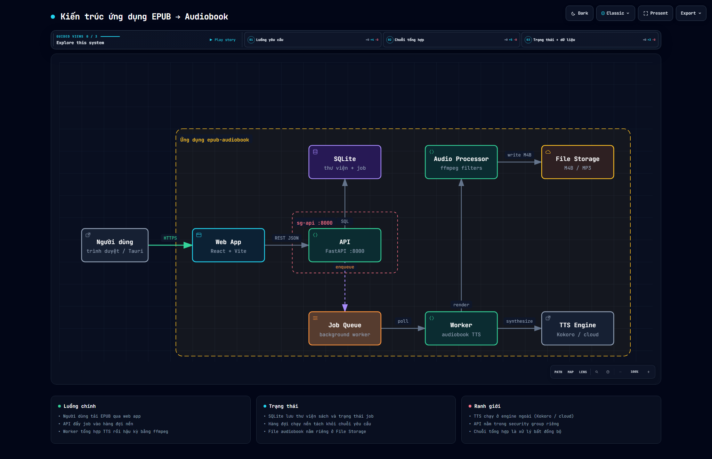
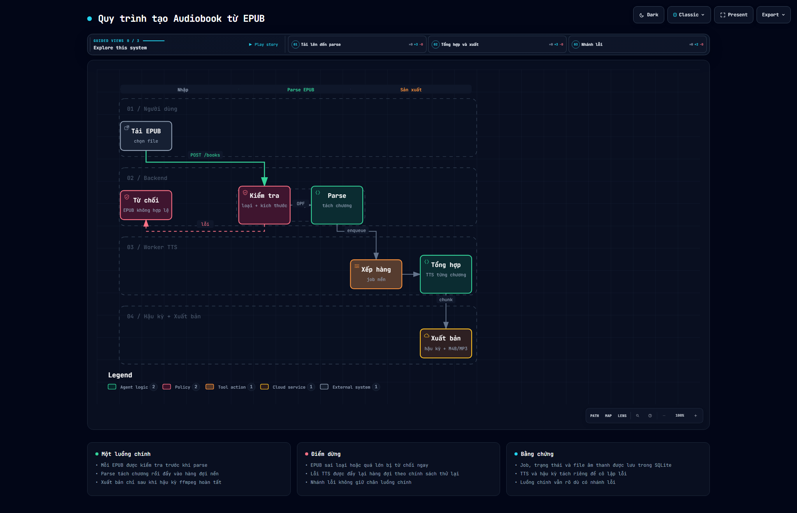
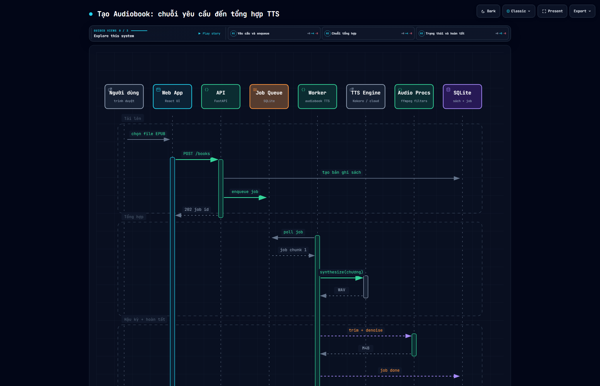

<div align="center">

# 📚 EPUB → Audiobook → Video

### Upload EPUB · Tách chương & patch · Tổng hợp TTS · Ghép audio · Tạo video · Auto-upload YouTube

*Toàn bộ công việc được theo dõi trong SQLite — crash rồi khởi động lại vẫn tiếp tục.*

<br />

[](https://www.python.org/)
[](app/main.py:127)
[](frontend/src)
[](vite.config.ts)
[](src-tauri/tauri.conf.json)
[](app/db.py)
[](LICENSE)

<br />

[✨ Tính năng](#-tính-năng) · [📊 Sơ đồ](#-sơ-đồ-hệ-thống) · [🚀 Bắt đầu](#-bắt-đầu-nhanh) · [📖 Tài liệu](#-pages--điều-hướng) · [⚙️ Cấu hình](#️-cấu-hình)

</div>

---

## 📑 Mục lục

- [✨ Tính năng](#-tính-năng)
- [📊 Sơ đồ hệ thống](#-sơ-đồ-hệ-thống)
- [🗂️ Cấu trúc thư mục](#️-cấu-trúc-thư-mục)
- [🚀 Bắt đầu nhanh](#-bắt-đầu-nhanh)
- [🔧 Yêu cầu hệ thống](#-yêu-cầu-hệ-thống)
- [⚙️ Cấu hình](#️-cấu-hình)
- [🧵 Hàng đợi & Worker](#-hàng-đợi--worker)
- [🎥 FFmpeg](#-ffmpeg--ffprobe)
- [▶️ Chạy ứng dụng](#️-chạy-ứng-dụng)
- [📖 Pages & Điều hướng](#-pages--điều-hướng)
- [🔌 API Endpoints](#-api-endpoints)
- [🧪 CLI Scripts](#-cli-scripts)
- [🔐 YouTube OAuth](#-youtube-oauth)
- [⚠️ Giới hạn đã biết](#️-giới-hạn-đã-biết)

---

## ✨ Tính năng

| Icon | Nhóm | Mô tả |
|------|------|-------|
| 📖 | **EPUB Parsing** | Trích xuất chương với phát hiện chương thông minh (`app/epub_parser.py:1`) |
| 🧩 | **Patch System** | Chia sách thành patch dễ quản lý (`app/chunker.py`) |
| 🎙️ | **TTS đa engine** | VoxCPM2 · OmniVoice · Confucius4-TTS · F5 ViVoice · VieNeu Fast · ZeroTTS · Edge TTS · gTTS — thống nhất qua `app/tts_engine.py` |
| 🗣️ | **Reference Voice** | Clone giọng từ thư viện `/voices`, preset `preset:<engine>:<voice>` (cache `data/voices/_presets`), hoặc clip riêng của sách |
| 📦 | **Batch Colab/Kaggle Export** | Xuất 1..n patch qua notebook batch chung — xem [Batch Export](#-batch-export-colabkaggle) |
| 🔗 | **Audio Merge** | Ghép patch thành audiobook hoàn chỉnh (`app/audio_merge.py`) |
| 🎬 | **Video Generation** | Tạo video với background riêng cho từng patch/chapter — multi-source + webcam PiP (`app/video_gen.py`, `app/video_compositor.py`) |
| 📤 | **YouTube Upload** | Auto-upload, thumbnail, playlist (`app/youtube.py`, `app/upload_worker.py`) |
| 🤖 | **Automated Patch Pipeline** | Overlay thumbnail → video (loop background + PiP) → upload YouTube, retry idempotent từng stage |
| ⚙️ | **Automation Settings** | FFmpeg presets, webcam, playlist defaults — validated Pydantic, default toàn cục + override JSON per-book |
| 🌗 | **Modern UI** | Dark mode, drag & drop, preview ảnh — React SPA duy nhất (`frontend/src`) |
| 📥 | **Batch Processing** | Upload nhiều sách, tạo video hàng loạt |
| ⚙️ | **Background Worker** | Queue không block UI, điều khiển admin |
| 💾 | **Crash Recovery** | SQLite tracking sống sót sau restart |

> **Confucius4 & F5 ViVoice** — cả hai đều là zero-shot voice-cloning cục bộ, cần clip giọng mẫu.
> - F5 ViVoice tự tải `hynt/F5-TTS-Vietnamese-ViVoice` lần đầu — cài bằng `pip install -e ".[f5-vivoice]"`.
> - Confucius4 hiện là repo `netease-youdao/Confucius4-TTS`: clone → `pip install -r requirements.txt` → set `CONFUCIUS4_REPO_DIR`.

---

## 📊 Sơ đồ hệ thống

> Toàn bộ sơ đồ là **HTML tương tác** (inline SVG, dark/light, pan/zoom, search/focus) được sinh bởi **archify** từ mã nguồn thực tế.
> Bấm vào thẻ để mở bản tương tác — hover để xem thumbnail.

<table>
<tr>
<td width="50%" align="center">

### 🏗️ Kiến trúc tổng thể
<a href="diagrams/epub-audiobook.architecture.html" title="Mở diagram kiến trúc tương tác">

</a>
<br />
<sub><code>architecture</code> · FastAPI + React SPA + Tauri · SQLite · Worker · YouTube/Drive</sub>
<br />
<a href="diagrams/epub-audiobook.architecture.html">🔍 Mở HTML tương tác</a> · <a href="diagrams/epub-audiobook.architecture.visual-check.2048x1320.light.png">🖼️ Light</a>

</td>
<td width="50%" align="center">

### 🔄 Quy trình (Workflow)
<a href="diagrams/epub-audiobook.workflow.html" title="Mở workflow tương tác">

</a>
<br />
<sub><code>workflow</code> · Upload → Parse → Patch → TTS → Merge → Video → YouTube</sub>
<br />
<a href="diagrams/epub-audiobook.workflow.html">🔍 Mở HTML tương tác</a> · <a href="diagrams/epub-audiobook.workflow.visual-check.2048x1320.light.png">🖼️ Light</a>

</td>
</tr>
<tr>
<td width="50%" align="center">

### 🔀 Chuỗi TTS (Sequence)
<a href="diagrams/epub-audiobook.sequence.html" title="Mở sequence tương tác">

</a>
<br />
<sub><code>sequence</code> · Client → API → Worker → TTS engines → Storage → Callback</sub>
<br />
<a href="diagrams/epub-audiobook.sequence.html">🔍 Mở HTML tương tác</a> · <a href="diagrams/epub-audiobook.sequence.visual-check.2048x1320.light.png">🖼️ Light</a>

</td>
<td width="50%" align="center">

### 🌊 Luồng dữ liệu (Dataflow)
<a href="diagrams/epub-audiobook.dataflow.html" title="Mở dataflow tương tác">

</a>
<br />
<sub><code>dataflow</code> · EPUB → Chunks → WAV → MP3 → MP4 → YouTube</sub>
<br />
<a href="diagrams/epub-audiobook.dataflow.html">🔍 Mở HTML tương tác</a> · <code>dataflow</code> HTML

</td>
</tr>
<tr>
<td width="50%" align="center" colspan="2">

### ♻️ Vòng đời Job (Lifecycle)
<a href="diagrams/epub-audiobook.lifecycle.html" title="Mở lifecycle tương tác">

</a>
<br />
<sub><code>lifecycle</code> · pending → processing → waiting_config/completed/failed → retry/requeue</sub>
<br />
<a href="diagrams/epub-audiobook.lifecycle.html">🔍 Mở HTML tương tác</a> · <code>lifecycle</code> HTML

</td>
</tr>
</table>

> 💡 **Mẹo xem diagram:** trong bản HTML, dùng `?theme=light`, `?present=1` hoặc `?embed=1` trên URL. Mỗi file đều có toolbar: pan/zoom, search, focus, semantic lens, export PNG/SVG.

<details>
<summary>📂 Danh sách file diagram (5 file — click để mở)</summary>

| # | Loại | File HTML | Thumbnail (dark / light) |
|---|------|-----------|--------------------------|
| 1 | 🏗️ architecture | [`diagrams/epub-audiobook.architecture.html`](diagrams/epub-audiobook.architecture.html) | [2048 dark](diagrams/epub-audiobook.architecture.visual-check.2048x1320.dark.png) · [light](diagrams/epub-audiobook.architecture.visual-check.2048x1320.light.png) |
| 2 | 🔄 workflow | [`diagrams/epub-audiobook.workflow.html`](diagrams/epub-audiobook.workflow.html) | [2048 dark](diagrams/epub-audiobook.workflow.visual-check.2048x1320.dark.png) · [light](diagrams/epub-audiobook.workflow.visual-check.2048x1320.light.png) |
| 3 | 🔀 sequence | [`diagrams/epub-audiobook.sequence.html`](diagrams/epub-audiobook.sequence.html) | [2048 dark](diagrams/epub-audiobook.sequence.visual-check.2048x1320.dark.png) · [light](diagrams/epub-audiobook.sequence.visual-check.2048x1320.light.png) |
| 4 | 🌊 dataflow | [`diagrams/epub-audiobook.dataflow.html`](diagrams/epub-audiobook.dataflow.html) | HTML tương tác |
| 5 | ♻️ lifecycle | [`diagrams/epub-audiobook.lifecycle.html`](diagrams/epub-audiobook.lifecycle.html) | HTML tương tác |

Spec JSON gốc nằm trong `diagrams/candidates/` (đã snapshot khi `deliver`).

</details>

---

## 🗂️ Cấu trúc thư mục

```
📦 epub-audiobook-app/
├── 🐍 app/                         # FastAPI backend
│   ├── main.py                     # FastAPI app, routes, lifespan
│   ├── config.py                   # Pydantic settings (.env)
│   ├── models.py / db.py           # SQLAlchemy + SQLite schema
│   ├── repository.py               # Data access layer
│   ├── epub_parser.py              # 📖 EPUB → chapters
│   ├── chunker.py                  # 🧩 Text → patches/chunks
│   ├── tts_engine.py               # 🎙️ VoxCPM2/OmniVoice/F5/... wrapper
│   ├── audio_merge.py              # 🔗 Ghép audio
│   ├── video_gen.py                # 🎬 ffmpeg (delegate compositor)
│   ├── video_compositor.py         # 🖼️ Multi-source FFmpeg + PiP
│   ├── ffmpeg.py                   # 🔧 ffmpeg/ffprobe utils
│   ├── youtube.py                  # 📤 YouTube API (upload/thumbnail/playlist/OAuth)
│   ├── worker.py + jobqueue/       # ⚙️ Background queue
│   ├── automation_*.py             # 🤖 Pipeline & settings
│   ├── gameplay_*.py               # 🎮 Gameplay procedural
│   ├── routes/                     # 🔌 API endpoints
│   │   ├── books.py                # Book CRUD & automation hook
│   │   ├── patches.py              # Patch management
│   │   ├── queue.py                # Queue status & controls
│   │   ├── video.py                # Video generation
│   │   ├── youtube.py              # YouTube OAuth
│   │   └── automation.py           # Automation settings/media/retry
│   └── spa_dist/                   # ⚛️ React build output (generated)
├── ⚛️ frontend/                    # React SPA — nguồn UI duy nhất
│   ├── src/                        # Components, pages, hooks
│   ├── public/                     # Static assets + PWA
│   └── index.html
├── 🖥️ src-tauri/                   # Tauri desktop shell
├── 📊 diagrams/                    # Archify diagrams (HTML + PNG + JSON)
│   ├── *.html                      # 5 HTML tương tác
│   ├── *.png                       # Visual-check thumbnails
│   └── candidates/*.json           # Spec snapshot
├── 📄 docs/                        # Tài liệu bổ sung
├── 🧪 tests/                       # pytest
├── 📜 scripts/                     # CLI helpers
├── 🎨 tailwind.config.js / vite.config.ts
└── 📦 pyproject.toml / package.json
```

> `frontend/` là nguồn giao diện duy nhất. Các URL cũ (`/books`, `/queue`, …) vẫn giữ để bookmark/OAuth hoạt động nhưng đều trả về cùng SPA shell. Không còn `app/templates` hay legacy JS/CSS.

---

## 🚀 Bắt đầu nhanh

### 🔧 Yêu cầu hệ thống

| Yêu cầu | Phiên bản |
|---------|-----------|
| 🐍 Python | `≥3.10, <3.13` |
| 📦 Node.js | `≥18` (cho frontend) |
| 🎥 FFmpeg | `ffmpeg` + `ffprobe` trong `PATH` hoặc `assets/bin/` |
| 🎮 VRAM (nếu dùng VoxCPM2) | `~8GB` — có thể fallback CPU / model nhỏ hơn |

### 📥 Cài đặt

```bash
# 1️⃣ Clone & tạo venv
python -m venv .venv
./.venv/Scripts/python.exe -m pip install -e .

# 2️⃣ TTS engine (tuỳ chọn)
./.venv/Scripts/python.exe -m pip install voxcpm          # VoxCPM2
./.venv/Scripts/python.exe -m pip install -e ".[f5-vivoice]"  # F5 ViVoice
./.venv/Scripts/python.exe -m pip install -e ".[all-tts]"     # tất cả TTS local
./.venv/Scripts/python.exe -m pip install -e ".[light-tts]"   # Edge TTS + gTTS + Piper

# 3️⃣ Môi trường
cp .env.example .env   # rồi chỉnh DATA_ROOT, YOUTUBE_*, v.v.
```

### ⚙️ Biến môi trường chính

| Biến | Mặc định | Ý nghĩa |
|------|----------|---------|
| `DATA_ROOT` | `./data` | 📁 Nơi lưu uploads & file sinh ra |
| `ENABLE_WORKER` | `true` | ⚙️ Bật/tắt background worker |
| `USE_NVENC` | `false` | 🎮 Encode video bằng NVENC |
| `YOUTUBE_*` | — | 🔐 OAuth client & default privacy/tags |

> Xem đầy đủ trong [`.env.example`](.env.example) — mọi field đều có default trong `app/config.py:1`, nên `.env` trống vẫn chạy được.

---

## 🧵 Hàng đợi & Worker

Tất cả việc nền (VoxCPM TTS, LightTTS, video render, YouTube upload) chạy qua **một queue** với concurrency riêng cho từng loại.

| Biến | Mặc định | Ý nghĩa |
|------|----------|---------|
| `QUEUE_CONCURRENCY` | `voxcpm_tts=1,video=2,youtube_upload=1` | 🔢 Concurrency per-type |
| `QUEUE_DEFAULT_CONCURRENCY` | `10` | Cap cho type chưa liệt kê (hiện là `light_tts`) |
| `QUEUE_LOG_RETENTION_DAYS` | `7` | 🗓️ Giữ log trong `data/logs/jobs/` |
| `QUEUE_REAP_AFTER_SECONDS` | `120` | ⏱️ Requeue job im lặng sau N giây |

> Đặt `0` để tắt hẳn một loại, ví dụ `voxcpm_tts=0` trên máy không có GPU. Trạng thái queue xem tại `/queue`.

---

## 🎥 FFmpeg / FFprobe

App cần `ffmpeg` + `ffprobe` để ghép audio & render video. Đặt `ffmpeg.exe` / `ffprobe.exe` vào `assets/bin/` (đã track qua Git LFS — có thể đã sẵn sau khi clone).

Nếu `assets/bin/` trống (chưa cài Git LFS), tải thủ công:

**🪟 Windows**
1. Tải build từ [gyan.dev](https://www.gyan.dev/ffmpeg/builds/) (`ffmpeg-release-essentials.zip`) hoặc [BtbN](https://github.com/BtbN/FFmpeg-Builds/releases).
2. Giải nén và copy `ffmpeg.exe` + `ffprobe.exe` từ `bin/` vào `assets/bin/`.

**🍎 macOS**
```bash
brew install ffmpeg
```

**🐧 Linux (Debian/Ubuntu)**
```bash
sudo apt install ffmpeg
```

Trên macOS/Linux, nếu `ffmpeg`/`ffprobe` đã có trong `PATH` thì không cần copy vào `assets/bin/`.

```bash
ffmpeg -version
ffprobe -version
```

---

## ▶️ Chạy ứng dụng

```bash
# Backend
./.venv/Scripts/python.exe -m uvicorn app.main:app --reload
# → http://localhost:8000
```

### ⚛️ SPA / PWA

Giao diện chính là **React SPA** do FastAPI phục vụ sau khi build:

```bash
npm install
npm run build
./.venv/Scripts/python.exe -m uvicorn app.main:app --reload
```

Dev: chạy backend ở `8000` rồi `npm run dev` ở terminal khác. PWA cài trực tiếp từ trình duyệt; API & media luôn dùng network để tránh cache dữ liệu vận hành.

### 🖥️ Tauri desktop

Tauri dùng chung backend FastAPI — chạy backend trước, rồi:

```bash
npm run tauri dev        # dev
npm run tauri build      # tạo installer (cần backend đã đóng gói)
```

### 📦 Batch Export → Colab/Kaggle

Remote TTS chỉ dùng workflow **batch**:

1. 📖 Mở sách → bảng **Patches**.
2. ☑️ Chọn một hoặc nhiều patch (chọn 1 patch vẫn là batch gồm 1 phần tử).
3. 📤 Bấm **Export** → chọn model TTS, voice/ngôn ngữ, chunk size, effects.
4. ⬇️ Tải ZIP, hoặc export vào Drive Desktop target, hoặc upload qua Drive API (cho Kaggle).
5. ▶️ Chạy `colab_kaggle_batch_tts_template.ipynb` trong package.
6. ⬆️ Import kết quả WAV trở lại app — video sẽ render локально.

Mỗi export chứa `batch_manifest.json` và dùng pipeline batch resumable (pause 300 ms giữa các chunk + chapter timeline). Package chỉ gồm **text + clip voice reference** — text chunk nằm trong `manifest.json` của từng patch, ảnh & nhạc nền ở lại app.

> Xem [`docs/google-drive-accounts.md`](docs/google-drive-accounts.md) để cấu hình Drive Desktop, rclone & Kaggle.

---

## 📖 Pages & Điều hướng

| Đường dẫn | Icon | Mô tả |
|-----------|------|-------|
| `/books` | 📚 | Upload EPUB, xem thư viện |
| `/books/{id}` | 📖 | Chi tiết sách, quản lý chapter/patch, enqueue/retry automation |
| `/queue` | ⚙️ | Monitor queue realtime |
| `/video` | 🎬 | Video creator độc lập (upload audio + background) |
| `/youtube` | 📤 | Quản lý upload YouTube (thumbnail + playlist) |
| `/automation/settings-page` | 🤖 | Cài đặt automation toàn cục |
| `/logs` | 📝 | Log ứng dụng |
| `/drive` | 💾 | Quản lý Google Drive sync targets & rclone |
| `/media-browser` | 🖼️ | Duyệt media library |

---

## 🔌 API Endpoints

| Method | Path | Icon | Mô tả |
|--------|------|------|-------|
| `POST` | `/api/books` | 📤 | Upload EPUB |
| `GET` | `/api/books` | 📚 | List all books |
| `GET` | `/api/books/{id}` | 📖 | Book details |
| `DELETE` | `/api/books/{id}` | 🗑️ | Delete book |
| `POST` | `/api/books/{id}/chapters/{ch}/exclude` | 🚫 | Toggle chapter exclude |
| `POST` | `/api/books/{id}/patches/build` | 🧩 | Build custom patches |
| `POST` | `/api/patches/{id}/regenerate` | 🔄 | Regenerate patch |
| `POST` | `/api/patches/{id}/replace` | ✏️ | Text replacement rules |
| `GET` | `/api/queue` | ⚙️ | Queue status |
| `POST` | `/api/queue/pause` | ⏸️ | Pause worker |
| `POST` | `/api/queue/resume` | ▶️ | Resume worker |
| `POST` | `/api/video/generate` | 🎬 | Generate video từ audio |
| `POST` | `/api/youtube/upload/{book_id}` | 📤 | Upload to YouTube |
| `GET` | `/automation/settings` | ⚙️ | Get automation config |
| `PUT` | `/automation/settings` | 💾 | Save automation config (validated) |
| `GET` | `/automation/media` | 🖼️ | List media assets |
| `PUT` | `/books/{id}/automation/media/{role}` | 🖼️ | Set ordered media (background/webcam) |
| `POST` | `/books/{id}/automation/enqueue` | 🤖 | Enqueue all patches cho pipeline |
| `POST` | `/books/{id}/automation/retry/{patch_id}` | 🔄 | Retry failed pipeline stage |

---

## 🧪 CLI Scripts

```bash
# 📖 Test EPUB parsing
python scripts/test_epub_parse.py <epub>

# 🧩 Test patch/chunk generation
python scripts/test_repo_and_chunker.py <epub>

# 🎙️ Test TTS (stub nếu thiếu --real)
python scripts/test_tts_single_patch.py <epub> --real

# 🔗 Test audio merge + 🎬 video
python scripts/test_merge_and_video.py

# ⚙️ Test full worker lifecycle
python scripts/test_worker.py
```

---

## ⚙️ Cấu hình tham chiếu

| Setting | Mặc định | Icon | Mô tả |
|---------|----------|------|-------|
| `DATA_ROOT` | `./data` | 📁 | Storage root |
| `DEFAULT_PATCH_SIZE` | `10` | 🧩 | Chapters per patch |
| `TTS_MAX_CHARS` | `400` | ✂️ | Max chars per TTS call |
| `USE_NVENC` | `false` | 🎮 | Hardware video encoding |
| `ENABLE_WORKER` | `true` | ⚙️ | Background processing |
| `WORKER_POLL_INTERVAL` | `2.0` | ⏱️ | Queue poll interval (sec) |
| `YOUTUBE_AUTO_UPLOAD` | `true` | 📤 | Auto-upload to YouTube |
| `YOUTUBE_DEFAULT_PRIVACY` | `private` | 🔒 | Video privacy |
| `RESET_ALL_JOBS_ON_STARTUP` | `false` | 🧹 | Dev-only DB reset |

---

## 🔐 YouTube OAuth

YouTube upload & post-processing cần OAuth 2.0. Scopes:

- `youtube.upload` — ⬆️ Upload videos
- `youtube` — 🖼️ Set thumbnails, manage playlists
- `youtube.force-ssl` — 🔒 Yêu cầu bởi YouTube Data API v3

Nếu reconnect sau khi đổi scope, app sẽ phát hiện thiếu scope và redirect re-authorization. Playlist mapping được persist per book/channel để tránh duplicate khi retry.

---

## ⚠️ Giới hạn đã biết

| # | Vấn đề |
|---|--------|
| 1 | `TTS_MAX_CHARS=400` chưa test kỹ — cần chỉnh sau khi test model thật |
| 2 | Progress theo dõi per-patch, chưa per-chunk |
| 3 | Một chapter nằm trên nhiều spine file sẽ hiện thành nhiều chapter |
| 4 | Video generation cần ffmpeg trong `PATH` hoặc `assets/bin/` |
| 5 | NVENC preset `h264_nvenc` phải sẵn sàng khi pipeline bắt đầu — không auto fallback sang CPU |

---

<div align="center">

### 💖 Đóng góp & Chuẩn hoá

Dự án tuân thủ **chuẩn hoá file** sau:

- 📄 `README.md` — single source of truth, heading có icon, bảng có icon, diagram gallery nhúng HTML+PNG
- 📊 `diagrams/*.html` — 5 diagram tương tác (archify `showcase`), snapshot JSON trong `candidates/`
- 🔧 `.env.example` — template đầy đủ, comment tiếng Việt/Anh
- 🎨 `frontend/` — Prettier + Tailwind, `npm run build` sinh `app/spa_dist/`
- 🧪 `tests/` — `pytest` + `httpx`, chạy `pytest -q`

<br />

**EPUB → Audiobook → Video** · Made with 🎙️ TTS · 🎬 FFmpeg · ⚛️ React · 🦀 Tauri

*Nếu README hữu ích, hãy ⭐ repo và mở diagram HTML để khám phá kiến trúc tương tác!*

</div>
